# Jobsheet 11 - Restful API 2

## Nama : Shasia Sasa Salsabyla

## Kelas : TI - 2F

## No.Absen/NIM : 25/2241720029

### Praktikum

Uji coba dan screenshot hasilnya apa perbedaan dari yang sebelumnya.

6.Lakukan modifikasi pada Controllers/Api/RegisterController

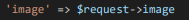

Hasil:

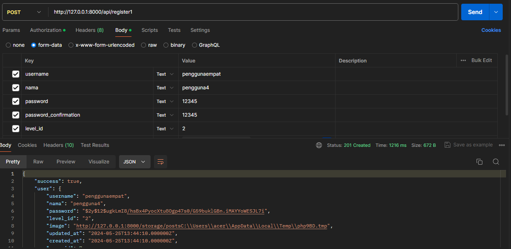

9.Pada Controllers/Api/RegisterController bagian create user ganti dengan

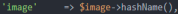

Hasil

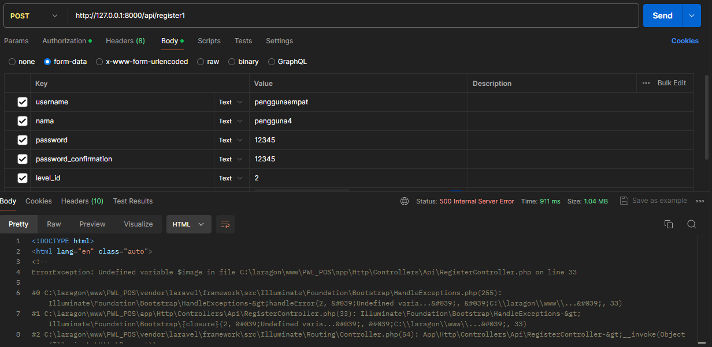

Perbedaannya adalah error dan tidak error. Tidak error karena variabel image terdefinisi. Error karena variabel image tidak terdefinisi karena tidak di request. Yang benar adalah harus diberi request dulu seperti berikut.

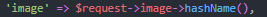

### TUGAS

Implementasikan API untuk upload file/gambar pada tabel lainnya yaitu tabel m_barang dan gunakan pada transaksi. Uji coba dengan method GET untuk memanggil data yang sudah di inputkan.

Jawab:

Modifikasi kode program dan membuat migration seperti berikut.

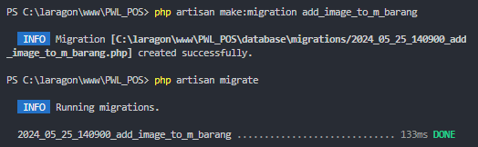

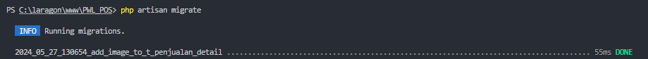

1. Barang

    a. Method POST

    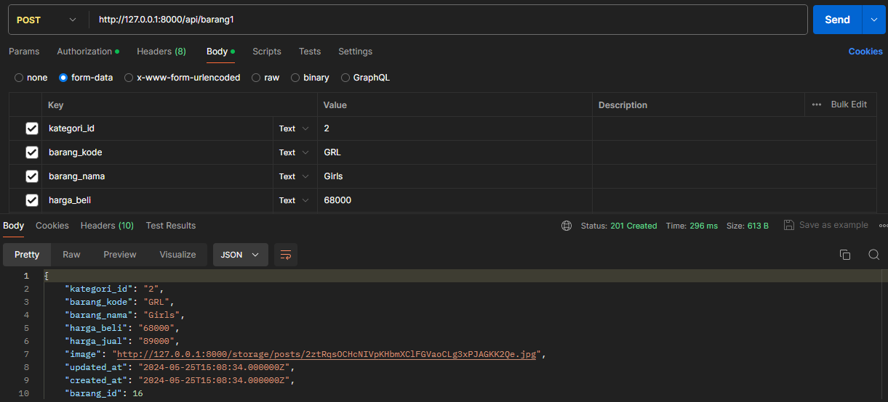

    b. Method GET

    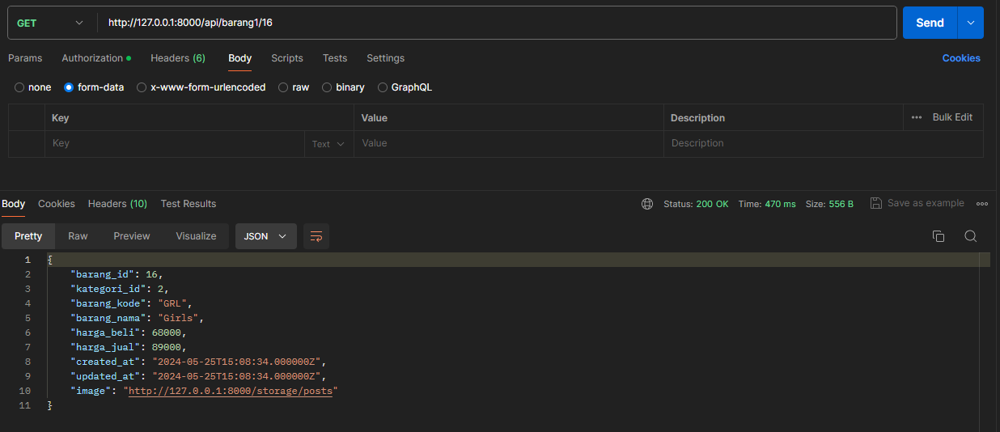

2. Transaksi

    a. Method POST

    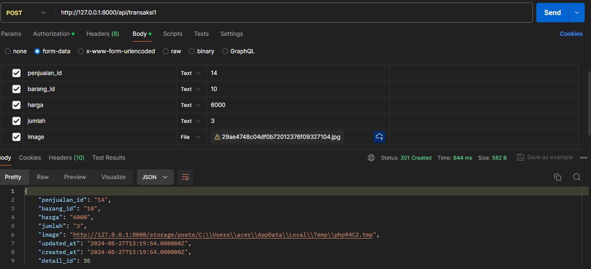

    b. Method GET

    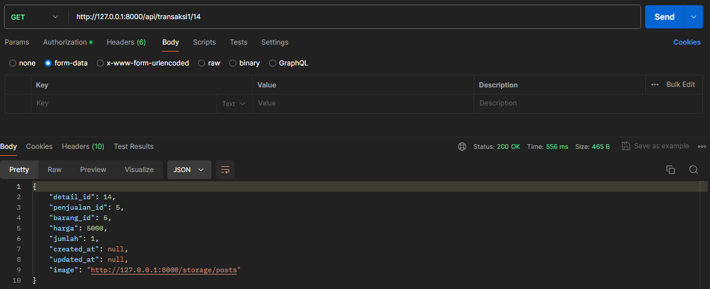
