# Jobsheet 4 - MODEL dan ELOQUENT ORM

## Nama : Shasia Sasa Salsabyla

## Kelas : TI - 2F

## No.Absen/NIM : 25/2241720029

### Jawablah pertanyaan berikut sesuai pemahaman materi di atas

1. Praktikum 1 - $fillable

    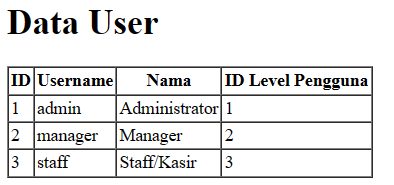

    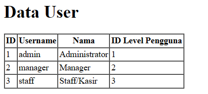

2. Praktikum 2.1 – Retrieving Single Models

    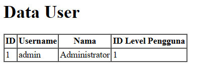

    Disini menampilkan data user dengan id 1 dari kode program "$user = UserModel::find(1);".

    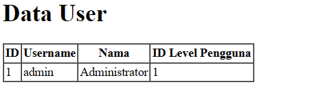

    Disini menampilkan data user dengan level id 1 pada daftar urutan pertama dari kode program "$user = UserModel::where('level_id', 1)->first();".

    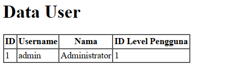

    Disini menampilkan data user dengan level id 1 dari kode program "$user = UserModel::firstWhere('level_id', 1);". Sama saja dengan sebelumnya, tapi lebih sederhana penulisannya.

    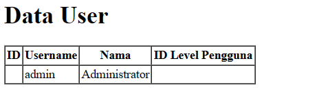

    Untuk mencari data dari tabel users dengan id 1. Jika tidak ditemukan, maka mencarinya berdasarkan username atau nama. Jika tidak ditemukan juga, akan menghasilkan respons HTTP 404. Pada halaman web yang ditampilkan menampilkan primary key 1 karena ditemukan.

    

    Seperti yang diatas, tapi id 20 tidak ditemukan maka menampilkan 404.

3. Praktikum 2.2 – Not Found Exceptions

    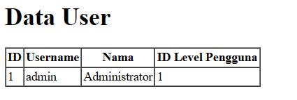

    Menampilkan data user dengan level id 1. Pada kode program, jika id 1 ditemukan maka menampilkan seperti pada gambar, jika tidak ditemukan akan menampilkan 404.

    

    Menampilkan 404 karena tidak menemukan username dengan nilai manager9.

4. Praktikum 2.3 – Retreiving Aggregrates

    

    Menampilkan jumlah user dengan level id 2 yang berjumlah 1.

    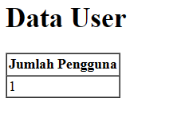

    Menampilkan jumlah user dengan level id 2 yang berjumlah 1 dengan tampilan seperti pada gambar.

5. Praktikum 2.4 – Retreiving or Creating Models

    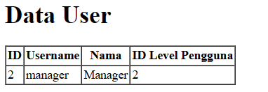

    Jika data ditemukan akan menampilkan data dengan username manager dan nama Manager. Jika data yang dicari tidak ditemukan maka akan membuat data baru dengan isi data sesuai yang dicari.

    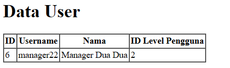

    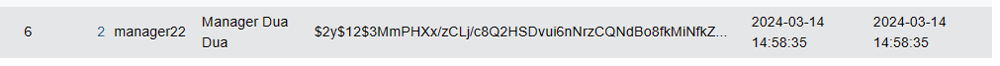

    Data tidak ditemukan sehingga membuat data baru.

    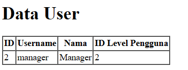

    Menampilkan data seperti pada gambar. Tapi jika tidak ditemukan maka akan dimasukkan kedalam database.

    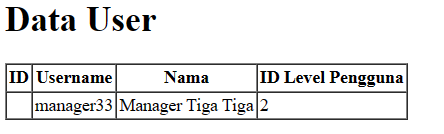

    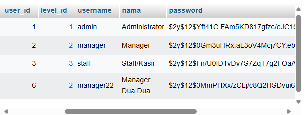

    Data sudah dibuat tapi belum masuk pada database.

    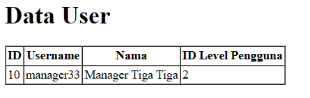

    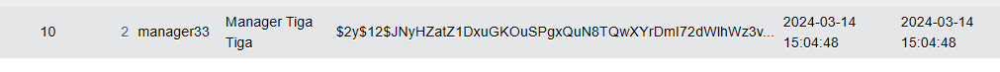

    Data yang dibuat sudah masuk dalam database menggunakan "$user->save".

6. Praktikum 2.5 – Attribute Changes

    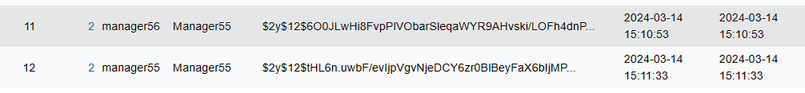

    "isDirty" menandakan adanya perubahan, ketika bernilai true menandakan telah dilakukan perubahan dan perlu disimpan. "isClean" menandakan tidak terjadi perubahan, ketika bernilai true menandakan bahwa tidak ada perubahan yang perlu diproses. Pada gambar tersebut menampilkan perubahan yang disimpan.

    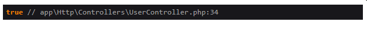

    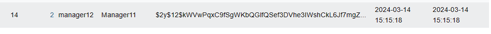

    Menampilkan true berarti terdapat perubahan sehingga data yang dimasukkan akan disimpan.

7. Praktikum 2.6 – Create, Read, Update, Delete (CRUD)

    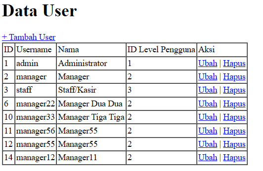

    Menampilkan data yang ada pada tabel data user.

    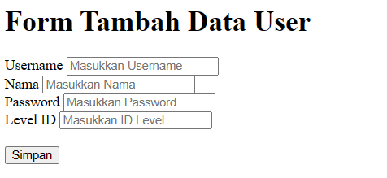

    Klik "+Tambah User" pada gambar sebelumnya, maka akan menampilkan gambar diatas untuk menginputkan data baru.

    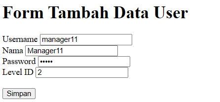

    Setelah input data, maka simpan data tersebut.

    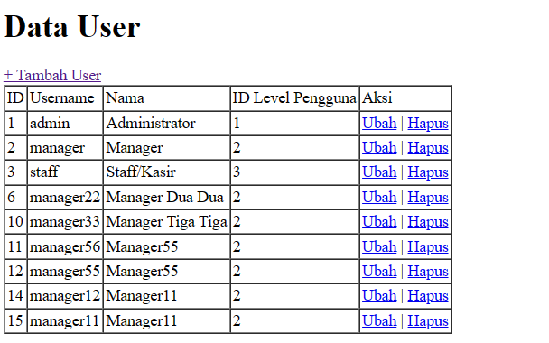

    Data yang telah di input dan disimpan akan terlihat pada tabel data user.

    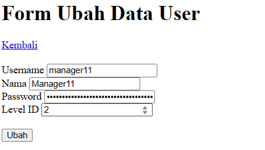
    Form untuk mengubah data.

    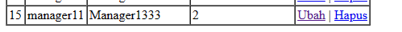

    Menyimpan data yang baru diubah, dan menampilkan seperti pada gambar.

    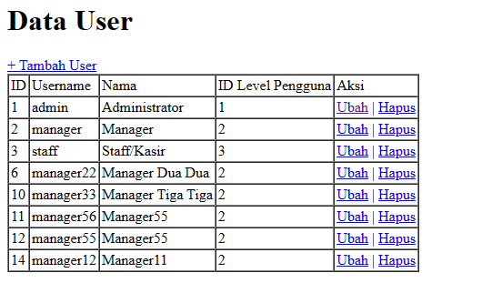

    Untuk menghapus data yang ingin dihapus.

8. Praktikum 2.7 – Relationships

    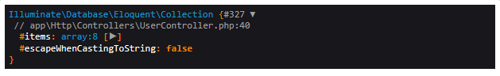

    Menampilkan relasi antar tabel yang dipilih.
