# Jobsheet 6 - Template Form (AdminLTE), Server Validation, Client Validation, CRUD

## Nama : Shasia Sasa Salsabyla

## Kelas : TI - 2F

## No.Absen/NIM : 25/2241720029

### Jawaban Praktikum

A. Template Form (AdminLTE)

8. Apa yang tampil?

    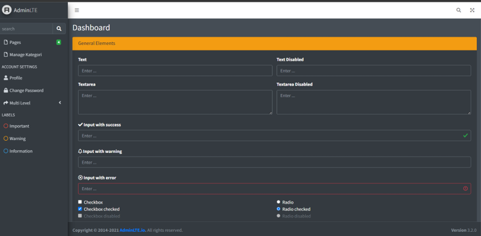

9. Eksplorasi jenis form pada adminLTE dan coba terapkan yang sesuai untuk studi kasus POS PWL, buatlah form untuk tabel m_user dan m_level

    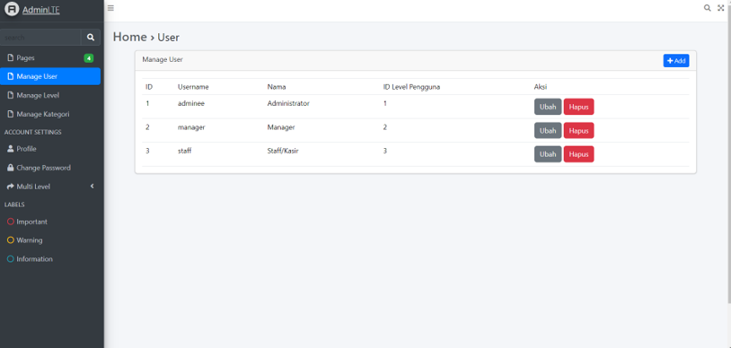

    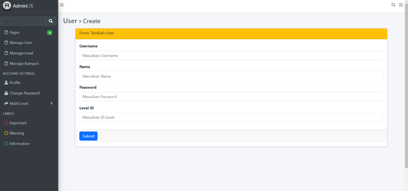

    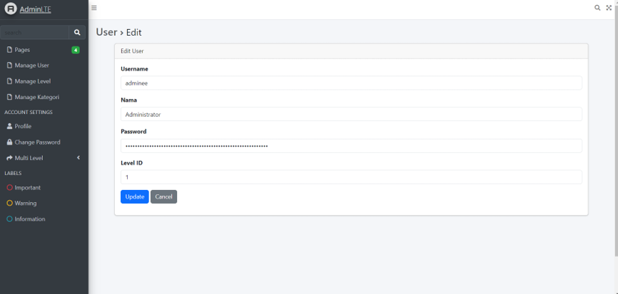

    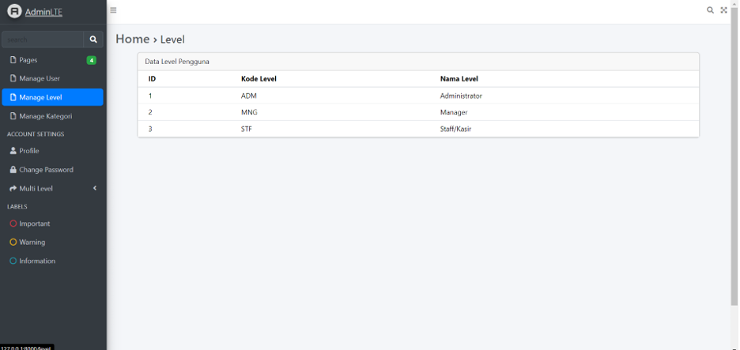

B. VALIDASI PADA SERVER

5. Tulis perbedaan penggunaan validate dengan validateWithBag!

    Jawab:

    Perbedannya yaitu, jika menggunakan validate maka secara otomatis mengatasi kesalahan tersebut lalu mengembalikannya. Sedangkan jika menggunakan validateWithBag, dapat memiliki kontrol yang lebih fleksibel karena dapat menyimpan pesan tersebut kedalam suatu wadah yang berbeda dan menangani secara terpisah.

6. Screenshot hasilnya.

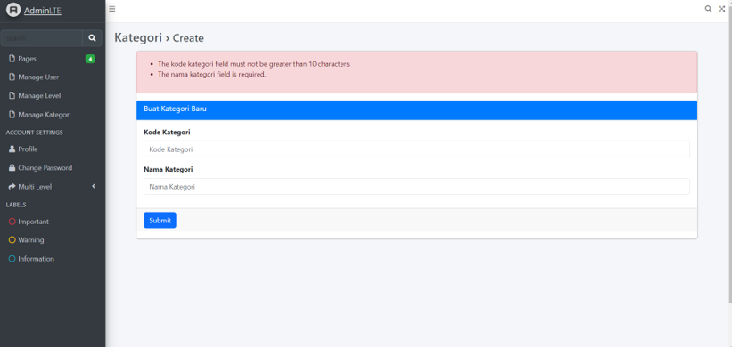

C. FORM REQUEST VALIDATION

3. Terapkan validasi juga pada tabel m_user dan m_level.

    Validasi tabel m_user

    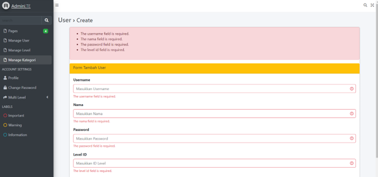

    Validasi tabel m_level

    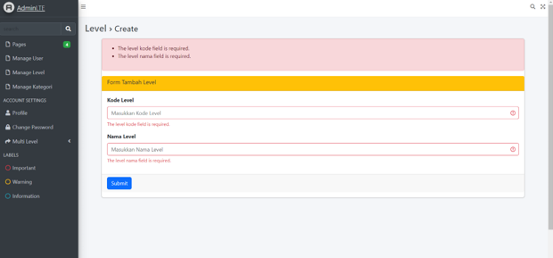

### Tugas

1. Coba tampilkan level_id pada halaman web tersebut dimana field ini merupakan foreign key

    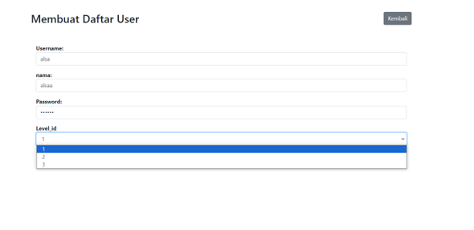

    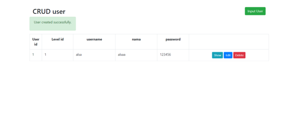

2. Modifikasi dengan tema/ template kesukaan Anda

    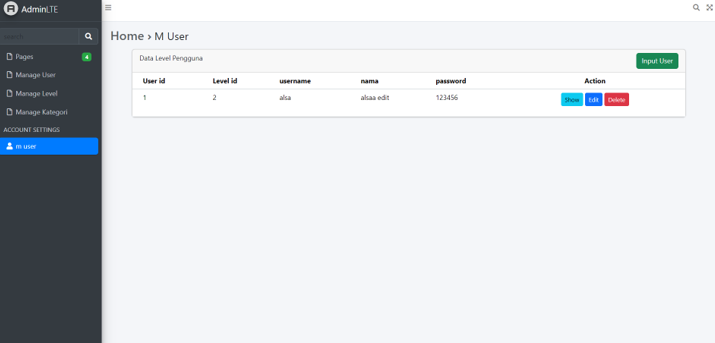

    

    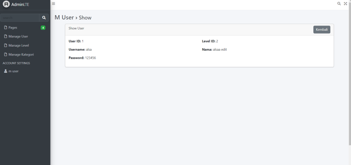

    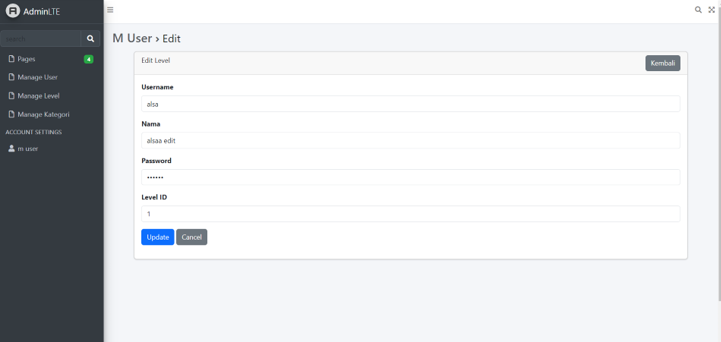

3. Apa fungsi $request->validate, $error dan alert yang ada pada halaman CRUD tersebut

    Jawab:

    - Fungsi dari $request->validate yaitu untuk melakukan validasi data yang di inputkan dari form.
    - Fungsi $errors adalah variabel global yang disediakan oleh Laravel untuk menampung kesalahan validasi.
    - Fungsi alert yaitu untuk menampilkan pesan kesalahan validasi.
