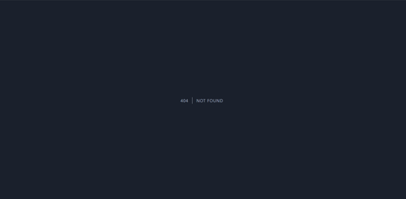
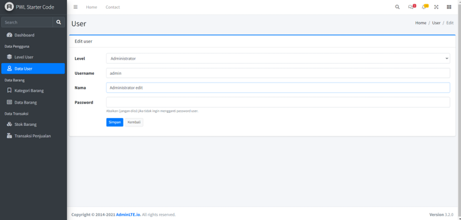
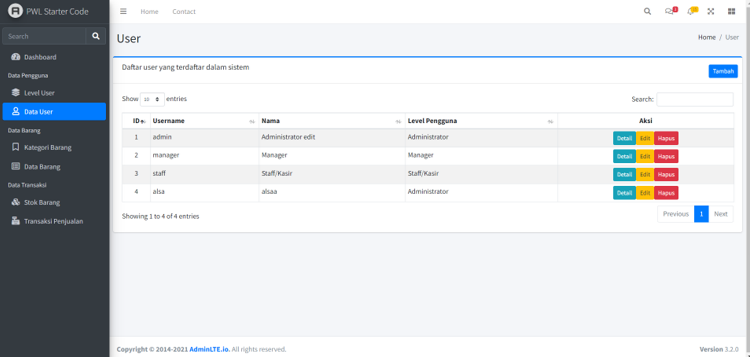
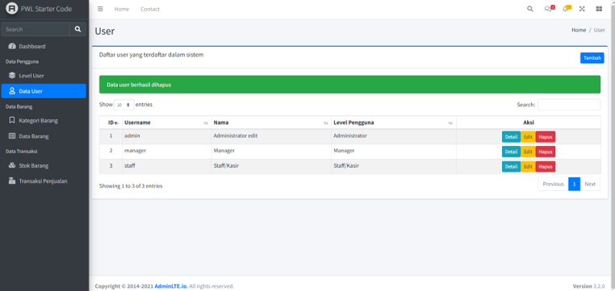

# Jobsheet 7 - LARAVEL STARTER CODE

## Nama : Shasia Sasa Salsabyla

## Kelas : TI - 2F

## No.Absen/NIM : 25/2241720029

### Jawaban Praktikum

D. Laravel Database

Praktikum 3 – Implementasi jQuery Datatable di AdminLTE

.16. Sekarang kalian coba untuk melihat detail data user di browser, dan coba untuk mengetikkan id yang salah contoh http://localhost/PWL_POS/public/user/100 amati apa yang terjadi, dan laporkan!!!

Jawab:

Halaman tidak ditemukan karena data yang dimiliki hanya sampai id 3 saja.

. 20. Sekarang kalian coba untuk mengedit data user di browser, amati, pahami, dan laporkan!

Jawab:

Sama seperti praktikum sebelumnya, ketika melakukan update akan terdapat pengecekan validasi terlebih dahulu dari data yang di inputkan, jika sudah sesuai maka lanjut pada proses update data, pada kolom password apabila tidak diisi maka akan tetap menggunakan password lama.

. 24. Kemudian jalankan browser untuk menghapus salah satu data user. Amati dan laporkan!

Jawab:

Jika sukses, maka muncul pesan berwana hijau diatas. Jika gagal maka pesan berwarna merah.

### Pertanyaan

Jawablah pertanyaan berikut sesuai pemahaman materi di atas

1. Apa perbedaan frontend template dengan backend template?

    Jawab:
    Frontend Template:

    - Untuk UI yang digunakan oleh user akhir.
    - Fokus pada desain dan pengalaman user.
    - Menggunakan HTML, CSS, JavaScript.

    Backend Template:

    - Untuk UI yang digunakan oleh admin.
    - Fokus pada fungsionalitas dan manajemen data.
    - Menggunakan Blade dalam Laravel.

2. Apakah layouting itu penting dalam membangun sebuah website?

    Jawab:

    Ya, layouting penting dalam membangun sebuah website karena sebagai kerangka dasar untuk tampilan halaman website, mengatur halaman agar rapi, dan memudahkan navigasi.

3. Jelaskan fungsi dari komponen laravel blade berikut: @include(), @extend(), @section(), @push(), @yield(), dan @stack()

    Jawab:

    - @include(): Untuk menyisipkan tampilan lain.
    - @extend(): Untuk mengindikasikan bahwa tampilan ini mewarisi template lain.
    - @section(): Untuk mendefinisikan konten bagian tertentu.
    - @push(): Untuk menambahkan konten ke stack.
    - @yield(): Untuk menampilkan konten dari section.
    - @stack(): Untuk menampilkan konten dari @push().

4. Apa fungsi dan tujuan dari variable $activeMenu ?

    Jawab:

    Variable $activeMenu digunakan untuk menandai menu yang sedang aktif atau membantu user mengetahui menu yang sedang di jalankan saat ini.
